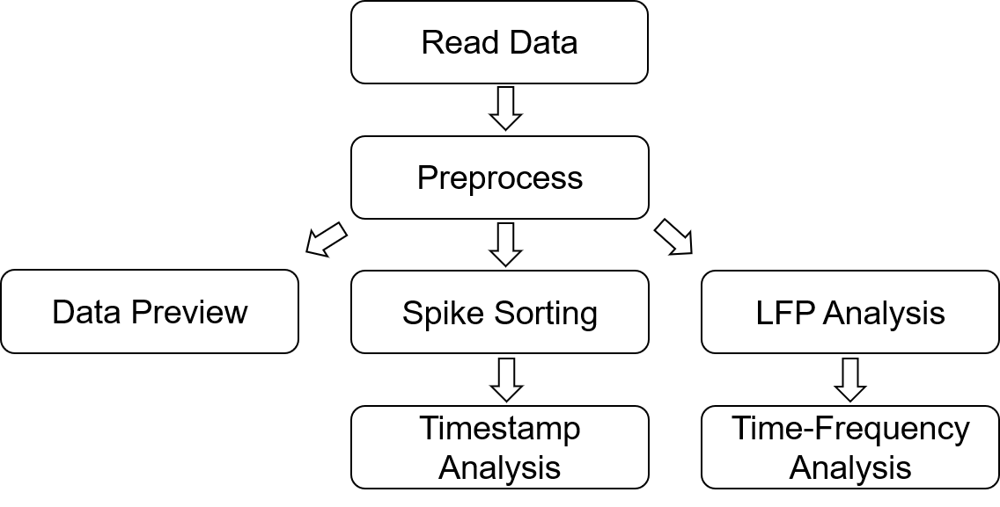
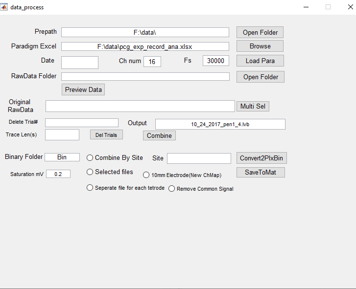

# _In vivo_ electrophysiology data analysis 
It was firstly written in *Matlab* and later in *Python*. GUIs are provided for both version.
## Data Format
Multi-channel _in vivo_ extracellular electrophysiology data is acquired via National-Instrument DAQ card to computer.\
Data acquisition electrical circuit programmed in Labview is required.\
Sample data is provided. See Folder `Sample data`.\
Raw data is in _*.lvb_ format. Binary data is read trial by trial controled by Labview loop logic circuit.\
Within each trial, the data is concatenate Channle-by-Channel. Thus, data is formated as:  
>  Ch1Trial1  Ch2Trial1 ... ChNTrial1 Ch1Trial2 Ch2Trial2 ... ChNTrial2 ...  
> (N: number of channels)
## Processing pipeline

## Data reading interface
For m files:\
start with `data_process.m` (with GUI)\
Click `data preview`, we will get `Data Preview` GUI.\

## Data Preview interface
