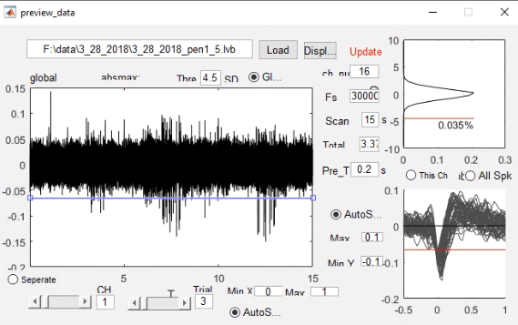
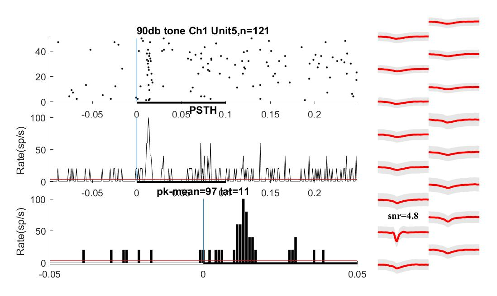
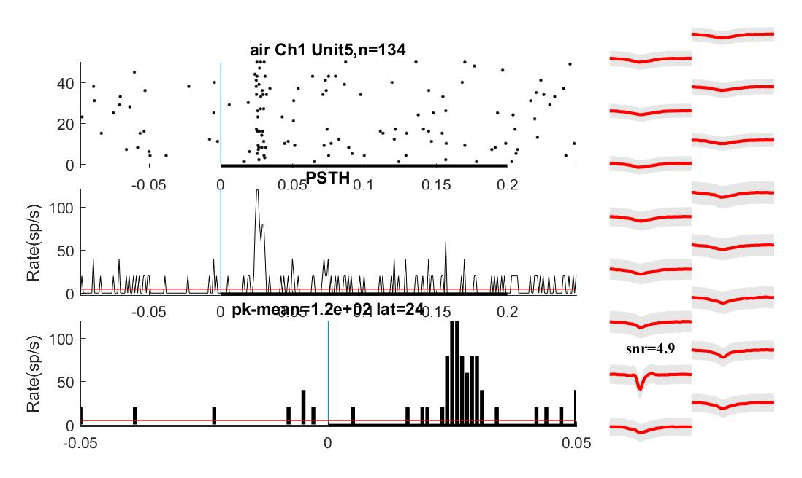
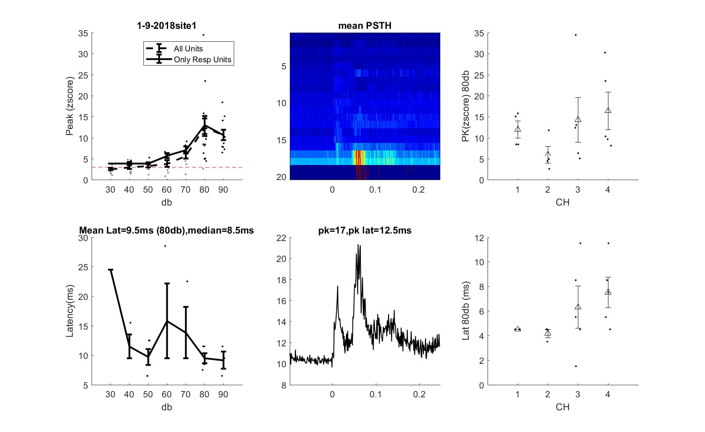
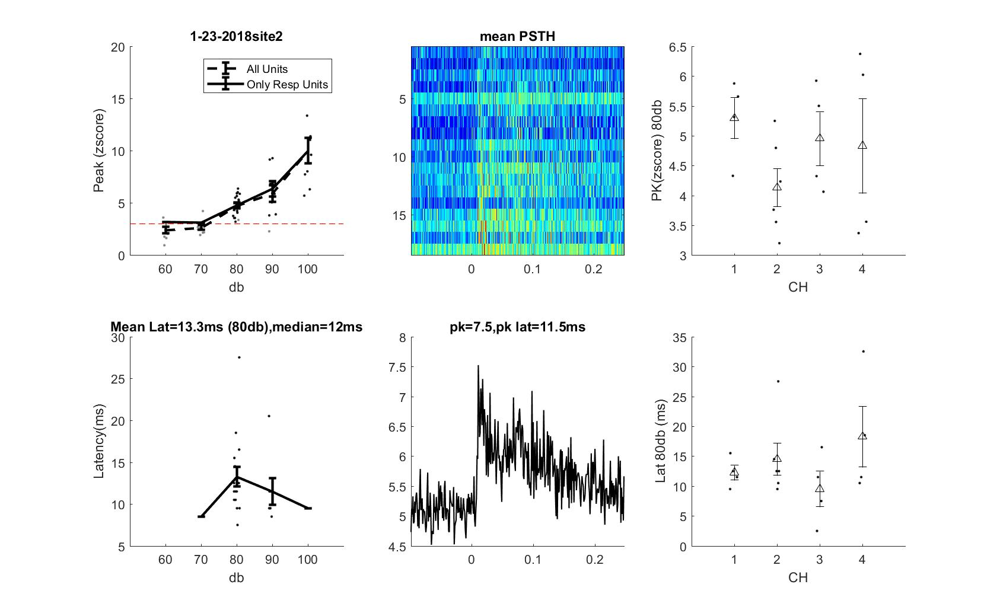

  

# _In vivo_ electrophysiology data analysis 
It was firstly written in *Matlab* and later in *Python*. GUIs are provided for both version.
## Data Format
Multi-channel _in vivo_ extracellular electrophysiology data is acquired via National-Instrument DAQ card to computer.\
Data acquisition electrical circuit programmed in Labview is required.\
Raw data is in _*.lvb_ format. Binary data is read trial by trial controled by Labview loop logic circuit.\
Within each trial, the data is concatenate Channle-by-Channel. Thus, data is formated as:  
>  Ch1Trial1  Ch2Trial1 ... ChNTrial1 Ch1Trial2 Ch2Trial2 ... ChNTrial2 ...  
> (N: number of channels)
Another important data would be `Experimental notes` which should contain information about each experiment. \
For example, `Date`, `Experiment Name`, `Stimulus Parameter`,`Total number of trials`, `Number of data samples in each trial`, and so on.

We save these information into an _excel_ file, with each datasheet with its name containing `Date` information, such as `12_11_2020`.\ 
Within each datasheet you can record any important information as `columns`. The key features to be read in current version for general purpose are:
> sample rate: `Fs`, Duration of record for each trial: `scal_len`, number of trials: `trial`
> another three key parameters used to identify the name of files to be processed: `site`, `record`, `penetration`.

This is because the data filename was aumatically organized by customized Labview circuits as: `date_penitration_recordnumber.lvb`, e.g. `8_14_2020_pen1_1.lvb`.
1. Since in each experiment, we may penetrate electrodes for multiple times (for multiple locations or for more attempts). So each attempt makes one penetration.
This number is recorded as `penetration`. 
2. For each `penetration`, you may record from multiple locations with different depth under the brain surface. Hence, you have different `site`. Though the automatic naming principle defined by Labview circuits without site information (e.g. `8_14_2020_pen1_1.lvb`), you need to specified in the _excel_ datasheets, since only signals from one single site can be pooled together for spike sorting (This guarentees these signals come from the same neuronal populations).
3. For each `site` (same population of neurons), you may want to apply different `stimulus protocols` or different `contexts` to evaluate neuronal signals, for each `protocol`, you record signals into seperated files specified by `record`.

Sample data is provided. Please see Folder `Sample data`.
## Processing pipeline

## Data reading interface
For _m files_:\
start with `data_process.m` (with GUI)\

This interface provides read experiment recording notes, such as `Date`, `Stimulus`, `Trials`, `Parameters`, etc.
Click `Preview Data` Button, we will get `Preview Data` GUI.
## Data Preview interface

## Timestamp Analysis (After Spike Sorting)
After sorting, spike timestamp data were processed to extract the key response properties and the results can be visualized as the exported figures. 
Two examples of the visualization of a single unit responsed to two different stimuli: _90db Tone_ and _airpuff_:
Response to _90db Tone_

Response to _airpuff_

## Further analysis: Summarize the results for each unit and each recording sessions for one experiments
Here are some examples of summarized units' response to sounds with different intensity (dB SPL):
summary example 1

summary example 2

summary example 3

